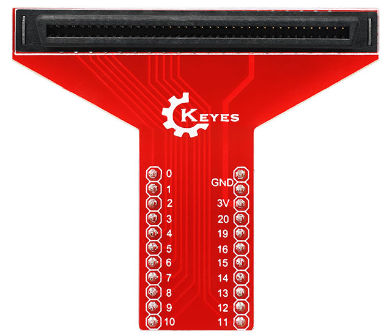
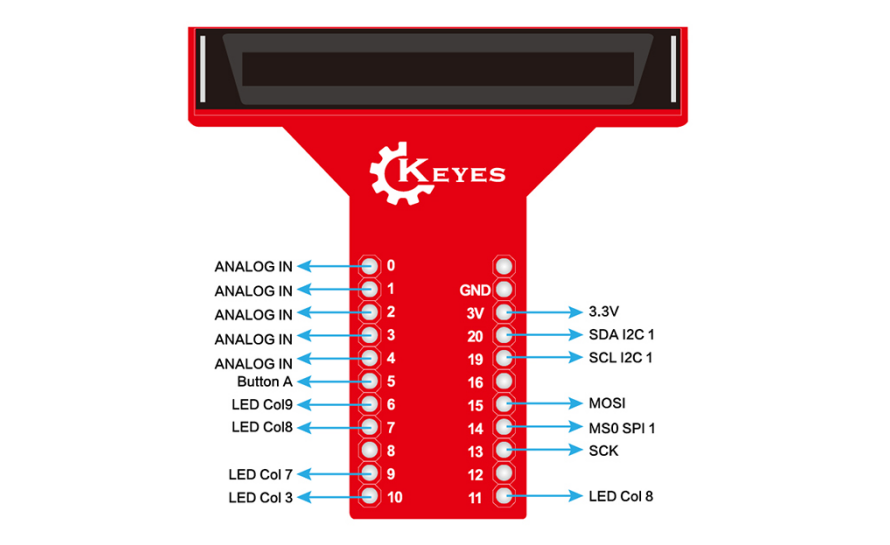
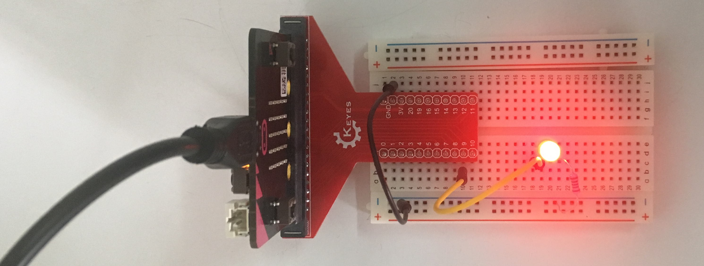
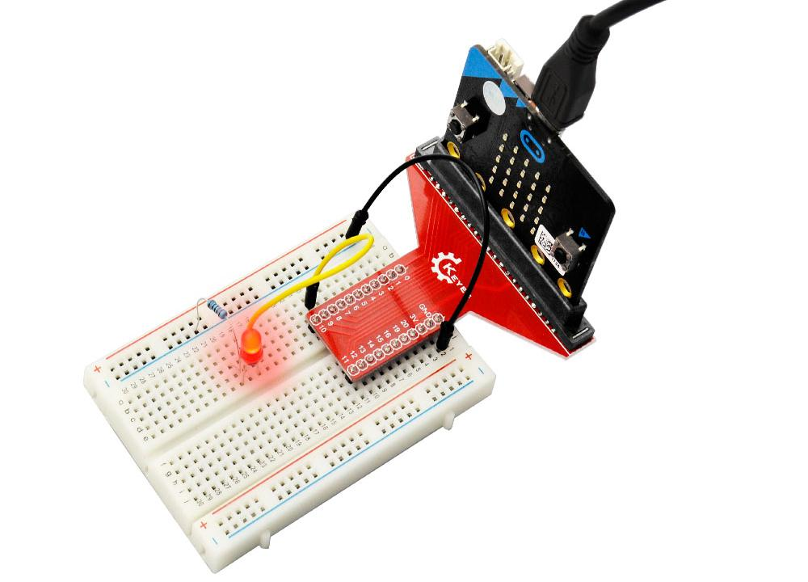

# KE0119 micro:bit T型扩展板 转接头 使用说明

## 1. 介绍
**KE0119 micro:bit T型扩展板 转接头** 是一款专为 BBC micro:bit 开发板设计的接口扩展硬件。通过该扩展板，你可以更便捷地将 micro:bit 的金手指引脚转换为常用的 2.54mm 排针形式，并直接插入面包板或连接各类外设，实现快速电路搭建和功能开发。该产品运用了相对环保的材料和电路工艺，既保证了使用安全，也符合对环保的追求。

## 2. 特点
1. **专用卡槽**：板载 micro:bit 专用插槽，金手指对准后直接插入，无需额外焊接或连接线。  
2. **T型布局**：将引脚排布在 T 字形的边缘，方便面包板或外设的接线排布。    
3. **环保材料**：采用无铅焊料、环保 PCB 制程，更安全、并避免对环境造成过多负担。  
4. **易上手**：有清晰的引脚标识，配合图形化编程环境，使教学和创客项目更简单。

## 3. 规格参数
| 项目         | 参数                                                         |
|--------------|------------------------------------------------------------|
| 适用主控     | BBC micro:bit (V1、V2)                                     |
| 输入电压     | micro:bit 自身 3V 为主     |
| 接口形式     | 2.54mm 排针                          |
| 工作温度     | 0℃ ~ 50℃（常规教学及室内环境即可）                          |
| 电路板材质   | FR-4 环保 PCB，表面无铅焊接处理                              |

## 4. 工作原理
 **金手指转接**：扩展板上的插槽与 micro:bit 金手指一一对应，将 micro:bit 的 P0、P1、P2、3.3V、GND 等引脚引出到扩展板排针接口。  

 **面包板连接**：将插好 micro:bit 的扩展板插入面包板，利用面包板孔位和杜邦线，将外设与所需引脚相连即可完成电路搭建。

## 5. 接口
1. **micro:bit 插槽**：位于扩展板顶部，用于安装 micro:bit。  
2. **引脚排针**：常见引脚会以排针形式延伸出来。    

## 6. 连接图
下面示例展示如何将 micro:bit 与 KE0119 T型扩展板结合，并在面包板上利用面包线连接一个 LED（带限流电阻）到 P0，引脚标注以示意为准。

- 将 micro:bit 插槽对准扩展板，插入到位；  
- 将扩展板的排针插入面包板；  
- 通过 330Ω（或 220Ω）限流电阻将 P0 与 LED 的正极相连，LED 负极再与 GND 相连；  
- 正确接线后，将 micro:bit 上电，加载合适程序即可点亮 LED。

## 7. 示例代码
在 MakeCode 中编写一个简单的闪烁程序，让 P0 输出高电平 1 秒、再输出低电平 1 秒，实现 LED 闪烁效果。

<iframe style="position:absolute;top:0;left:0;width:100%;height:100%;" src="https://makecode.microbit.org/#pub:_8UPchYTPA64p" frameborder="0" sandbox="allow-popups allow-forms allow-scripts allow-same-origin"></iframe>

将此程序下载到 micro:bit 后，如果连接无误，LED 将间歇性亮灭。

## 8. 实验现象

- **LED 闪烁**：连接的 LED 每隔 1 秒亮、1 秒灭；  

- **可调节频率**：更改 `basic.pause(1000)` 时间可让闪烁更快或更慢；  

- **其他功能**：当接入不同外设（如蜂鸣器、动作传感器）时，通过相应程序可实现感应控制或输出指示等功能。

## 9. 注意事项
1. **插拔顺序**：先断电，再插拔 micro:bit 与扩展板，防止产生静电损坏或短路。  
2. **引脚标识**：使用前认真查看扩展板丝印标注，避免接线错误导致设备故障。  
3. **限流电阻**：驱动 LED 等外设时要预留适当限流电阻，保护微控引脚。  
4. **电压选择**：micro:bit 默认输出 3V，如需 5V 的外设，请确认扩展板是否支持并需外接 5V 电源。  
5. **功耗评估**：若要驱动马达或大功率设备，应搭配专用驱动板或外接电源，切勿直接使用 micro:bit 输出电流。  

## 10. 参考链接
- [BBC micro:bit 官方网站](https://microbit.org/)  
- [MakeCode 在线编程](https://makecode.microbit.org/)  
- [Keyes 官网](http://www.keyes-robot.com/)  
- [Keyes 天猫旗舰店](https://keyes.tmall.com/)  
- [micro:bit 教学资源](https://microbit.org/teach/)

