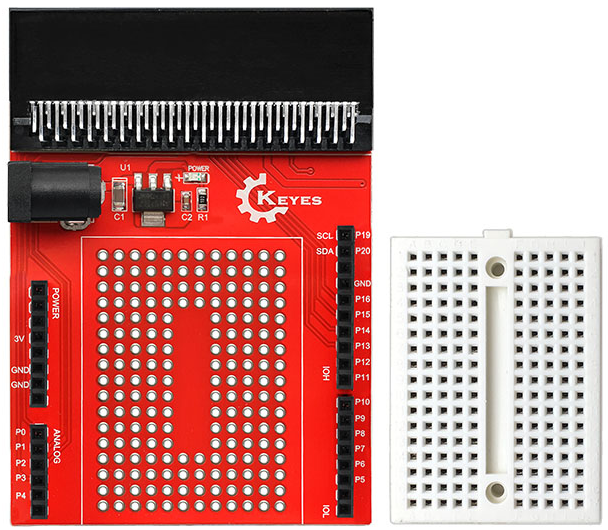

# KE0120 micro:bit 原型扩展板 V1（含小面包板） 使用说明

## 1. 介绍
**KE0120 micro:bit 原型扩展板 V1** 是一款为 BBC micro:bit 打造的多功能原型开发板，配合一块小巧的面包板，让你无需额外焊接即可进行电路搭建和实验。通过将 micro:bit 插入该扩展板后，板上的原型区和面包板皆能方便地布置各类元器件、传感器和模块，实现快速的电路原型开发。

---

## 2. 特点
1. **集成面包板**：在扩展板上预留了卡槽或空间，直接嵌入附带的小型面包板，让电路搭建更加集中、整洁。  
2. **兼容性好**：适用于 BBC micro:bit (V1、V2)，所有主要引脚如 P0、P1、P2、3.3V、GND 等都清晰引出。  
3. **免焊接原型区**：部分区域可能带有排孔，可使用焊接方式扩展；也可使用自带面包板实现完全免焊接。  
4. **合理布局**：将控制端口、Power、GND 及 IO 排列在一侧或两侧，便于使用杜邦线有序连接。  
5. **稳固卡口**：micro:bit 通过插槽与扩展板固定，减少接触不良或插拔错误的风险。

---

## 3. 规格参数
| 项目            | 参数                                                       |
|-----------------|----------------------------------------------------------|
| 适用主控        | BBC micro:bit (V1、V2)                                   |
| 工作电压        | 3V (默认由 micro:bit 提供)，也可视板上设计外供 5V          |
| 板上接口        | 排针、面包孔、电源接口、3V/5V 供电（不同版本略有区别）      |
| 板体尺寸        | 约 80×55mm（含面包板空间，具体以实物为准）                 |
| 小面包板尺寸     | 通常 170 孔左右(如 8×10 孔)，可根据实际版本略有变化         |
| PCB 工艺        | 环保无铅焊料，FR-4 材质                                   |
| 重量            | 约 25 g（含面包板，略有浮动）                              |

---

## 4. 工作原理
1. **金手指对接**：将 micro:bit 的金手指与扩展板顶部插槽或排针对接，把各 IO、3V、GND 引脚转换到原型区或面包板区域。  

2. **面包板式搭建**：小面包板提供横/纵排孔，用于插入元器件、传感器、LED、按键、线缆等，实现免焊快速原型。  

	

3. **扩展供电（可选）**：若外设需求超出 micro:bit 的 3V 输出，可在板上接入单独电源（如 5V），并配合电平转换或驱动模块使用。

---

## 5. 接口
1. **micro:bit 插槽**  
   - 用于安放 micro:bit，本体的金手指与扩展板的一体插座接触。
2. **电源接口**  
   - 一般包含 3V、GND 以及可能预留 5V 接口（需要外接），使你可驱动更高电压的外设。  
3. **排针脚**  
   - P0、P1、P2、P3……等 IO 引脚以排针或焊盘形式延伸到面包板附近，便于直接插线或插入模块。  
4. **面包板区域**  
   - 板载小型面包板，可随意插接元器件和跳线。通常有若干横排/竖排连接孔位，以字母和数字标识。  
5. **原型区（可选）**  
   - 有些版本除面包板外，还带有焊孔区域，满足更复杂的 DIY 需求。

---

## 6. 连接图
下面以一个 LED + 按键 的简单电路为例，展示 micro:bit 经扩展板与小面包板的连接示意：

- 将 micro:bit 插入扩展板插槽；  
- 在面包板上插入 LED（带限流电阻）与按键，根据需要将 LED 一端接到 P0，另一端连 GND；  
- 按键一端接 P1，另一端接 GND，或可外加上拉电阻/软件内部上拉配置；  
- 根据电路需求，可引出 3V 做电源供给。

---

## 7. 示例代码
以下示例使用 MakeCode 图形化编程演示，假设 LED 连到 P0，按键连到 P1（默认上拉），当按下按键时，则点亮 LED，否则熄灭。

<iframe style="position:absolute;top:0;left:0;width:100%;height:100%;" src="https://makecode.microbit.org/#pub:_d6dVA3Ff0PVo" frameborder="0" sandbox="allow-popups allow-forms allow-scripts allow-same-origin"></iframe>

- 如果你的按键是将 P1 与 3V 接通，则需将 “0” 改为 “1”；同时注意初始化时启用内部下拉或外部下拉电阻。

---

## 8. 实验现象
1. **按键与 LED**：按键被点击时，LED 亮；未按下时，LED 灭。  
2. **可添加更多外设**：面包板区域支持更多元器件，例如蜂鸣器、温度传感器、声光模块等，灵活搭配。  
3. **调试简便**：如果连线不正确，可快速重新拔插调整，而无须反复焊接。

---

## 9. 注意事项
1. **插拔规范**：插 micro:bit 前应确保电源断开，避免插歪或插反；  
2. **限流电阻**：为保护 micro:bit IO，不论是 LED 还是蜂鸣器，都需在电路中添加合适限流/限流电阻；  
3. **外接电压**：如有使用 5V 外接电源，应确认外设对电压要求，micro:bit 引脚仅能承受 3V 输入；若需电平转换必须做好防护；  
4. **输出能力**：单个 IO 引脚最大输出电流有限，驱动较大功率元件应借助驱动模块或 MOS 管；  
5. **稳定性**：固定面包板时，可使用双面胶或螺丝（若有孔位）进行稳固，防止因为晃动导致松脱；  
6. **衔接牢固**：扩展板和 micro:bit 之间的接触需保持干净，金手指上的污垢或氧化层会导致接触不良。

---

## 10. 参考链接
- [micro:bit 官网](https://microbit.org/)  
- [MakeCode 在线编程平台](https://makecode.microbit.org/)  
- [Keyes 官网](http://www.keyes-robot.com/)  
- [Keyes 天猫旗舰店](https://keyes.tmall.com/)  
- [micro:bit 教学资源与示例](https://microbit.org/teach/)  

通过 **KE0120 micro:bit 原型扩展板 V1（含小面包板）**，你可以更高效地进行电路原型搭建，在不需要焊接的情况下快速完成从代码到硬件实例的调试与验证，为创意项目和课堂教学带来更多可能性。祝你玩得开心，创作无限！
