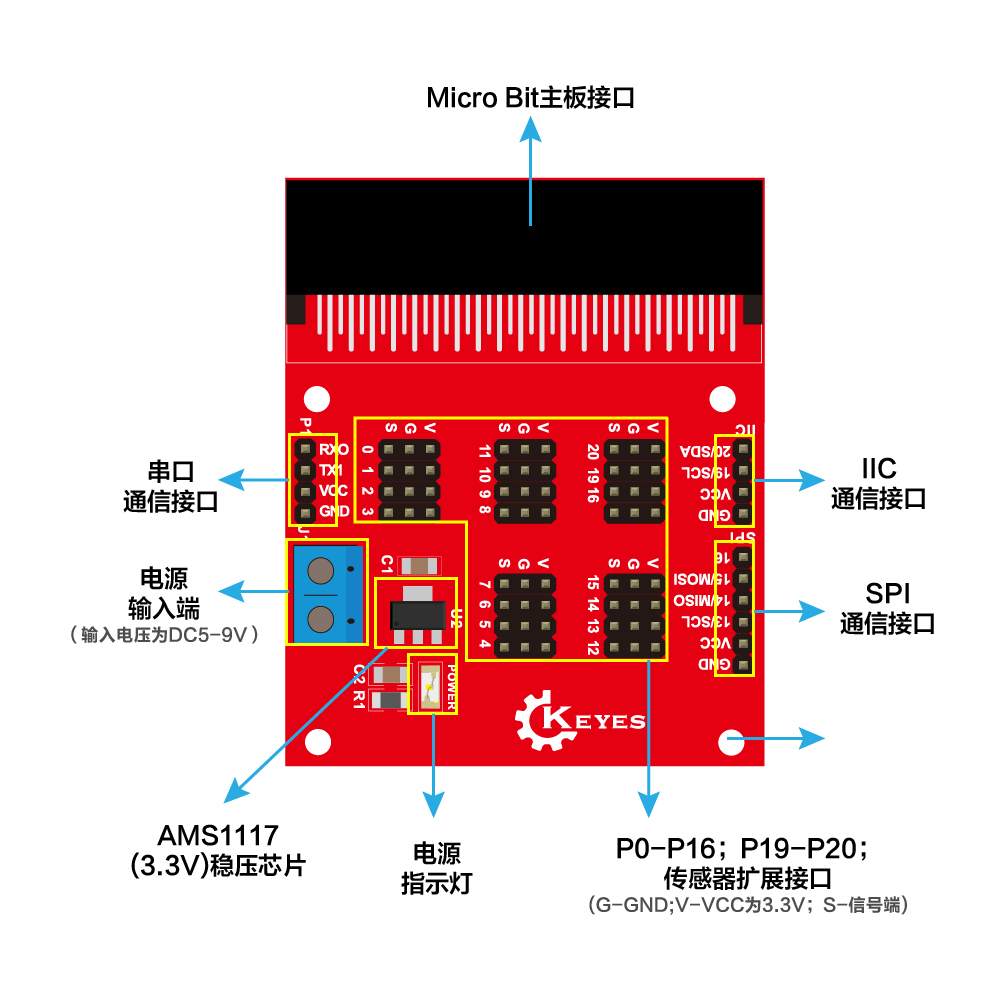

# KE0121 micro:bit 传感器扩展板 使用说明

## 1. 介绍  
**micro:bit** 是由英国广播电视公司（BBC）为青少年编程教育设计的一款入门级开发板。该主控板支持微软开发的 PXT 图形化编程界面（又称 MakeCode），无需额外下载编译器，可在 Windows、macOS、iOS、Android 等多种操作系统上使用，让初学者仅通过拖拽代码模块即可快速入门编程。

为了方便 micro:bit 开发板与各类传感器、执行器及不同通信设备进行对接，我们推出了 **KE0121 micro:bit 传感器扩展板**。该扩展板内置供电模块，为 micro:bit 及外部设备提供更稳定的电源，提升整体带载能力；同时将 micro:bit IO 口按 G（地）、V（电源）、S（信号）三线形式排布，更直观易插；此外，还特别预留了 **I2C、串口 (UART)、SPI** 等多种通信端口，满足多样化应用需求。

通过将 micro:bit 插入 KE0121 传感器扩展板，可在保证 micro:bit 精简可编程特性的前提下，实现更丰富的传感器和模块接入，大幅拓展创意项目与教学实验的可能性。

---

## 2. 特点  
1. **板载供电模块**  
   - 外接电源后，直接对 micro:bit 及外设供电，提供 3V/5V 等电源输出（视具体版本）；  
   - 带载能力更强，适合需要更多用电的传感器或舵机模块。

2. **GVS 舵机式接口**  
   - micro:bit 主要 IO 以 G、V、S 三线顺序排布，方便快速连接常见舵机或三线式传感器；  
   - 接线更简单，减少插反风险。

3. **支持多种通信**  
   - **I2C**：方便连接数字传感器、OLED 显示或扩展芯片；  
   - **UART**：可对接蓝牙串口模块、USB 转串口或其它串口设备；  
   - **SPI**：适用于高速外设，如显示屏、射频模块等。

4. **插拔即用**  
   - micro:bit 金手指与扩展板插槽对接即可使用，无需额外排线或焊接；  
   - 对初学者及课堂教学十分友好，大大减少外设连线复杂度。

5. **安全环保**  
   - 扩展板采用环保 PCB 制程与无铅焊料，板载电源模块设计也注重对主板和外设的过流/过压保护；  
   - 兼容 BBC micro:bit V1、V2 及后续版本。

---

## 3. 规格参数  
| 项目               | 参数                                                         |
|--------------------|------------------------------------------------------------|
| 适用主控           | BBC micro:bit (V1、V2)                                     |
| 工作电压           | 3V/5V（由板载电源或外接 DC 供电，具体以实物为准）            |
| 扩展接口           | GVS（舵机口），I2C，UART，SPI 等                          |
| 板体尺寸           | 约 60×50 mm（实际尺寸依配置而略有差异）                    |
| PCB 工艺           | FR-4 环保基材，无铅焊接工艺                                 |
| 重量               | 约 15~20 g                                                 |

---

## 4. 工作原理  
1. **供电与稳压**  
   - 在扩展板上连接外部供电（如 DC 5V），再经板载电路转换提供给 micro:bit 与传感器；  
   - 若仅需简单实验，可使用 micro:bit 自带电池盒供电，但板载电源可提供更大的驱动能力。

2. **IO 与通信重映射**  
   - micro:bit IO（P0、P1、P2 等）通过板载GVS接口呈现，保持信号、VCC、GND 同位；  
   - I2C、UART、SPI 的专用或多路引脚亦在扩展板上对应标识，方便各通信模块直连。

3. **板级保护设计**  
   - 附带部分滤波、稳压或电平转换器件，提供稳定的输入电源与可靠的信号连接；  
   - 避免单纯依靠 micro:bit 3V 输出，减少可能的电压不稳或 IO 损坏风险。

---

## 5. 接口说明  
1. **micro:bit 插槽**：将 micro:bit 金手指插入固定槽，无需额外线缆。  
2. **外接电源接口**：通常为 DC 插孔或 micro USB，输入 5V（请参考实物标注），以便给板载稳压模块供电。  
3. **GVS 舵机口**：每一组包含 G（地）、V（电源）、S（信号）三针脚，对应一个或多个 IO。  
4. **I2C、UART、SPI**：以排针或专门接口形式呈现，用于连接各种数字通信外设。  
5. **其他功能接口**：部分扩展板可能有 LED 指示灯、电源开关等，具体以实际产品为准。

---

## 6. 连接示例  
示例：通过 GVS 接口，将一个 LED 模块插在 P10（GVS）。示意图如下：

-------

## 7. 示例代码

<iframe style="position:absolute;top:0;left:0;width:100%;height:100%;" src="https://makecode.microbit.org/#pub:_af2Jz6CKRDoF" frameborder="0" sandbox="allow-popups allow-forms allow-scripts allow-same-origin"></iframe>

## 8. 实验现象  
- LED 会根据编程控制被点亮和熄灭；  
- 外部供电能力充足时，可同时驱动多个 LED 模块。

---

## 9. 注意事项  
1. **正确改接电源**：使用外部电源前，检查极性与电压范围，避免损坏扩展板或 micro:bit；  
2. **插卡方向**：micro:bit 金手指插槽方向一定要与扩展板对应标识对齐；  
3. **IO 限流与保护**：舵机电流过大时，请确保电源与扩展板能支持足够电流，若仍不足，建议另加驱动板；  
4. **环保与回收**：本扩展板采用环保材料，使用后应妥善保管或回收，不要随意丢弃；  
5. **静电防护**：操作前可摸下金属物体或佩戴防静电腕带，减少因静电产生的硬件损坏；  
6. **定期检查**：如发生发热或功能异常，应及时断电并检查电路连线是否正确。

---

## 10. 参考链接  
- [BBC micro:bit 官网](https://microbit.org/)  
- [MakeCode 在线编程平台](https://makecode.microbit.org/)  
- [Keyes 官网](http://www.keyes-robot.com/)  
- [Keyes 天猫旗舰店](https://keyes.tmall.com/)  
- [micro:bit 教学与资源](https://microbit.org/teach/)  

通过 **KE0121 micro:bit 传感器扩展板**，你可以轻松地将 micro:bit 与多种传感器和模块组合起来，快速实现从简单的舵机控制到复杂的多传感器融合等丰富应用。愿你在探索与创作中体验到更多乐趣与成就！
