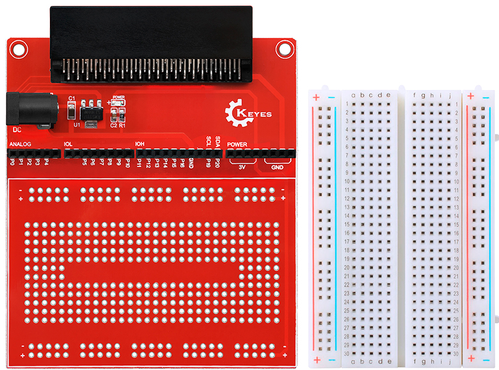
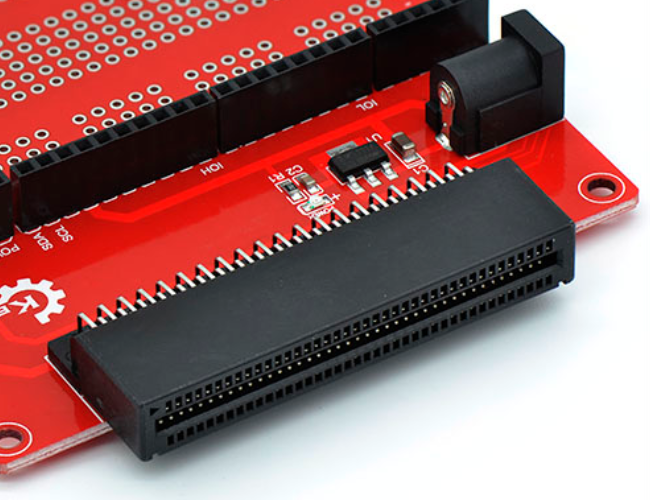
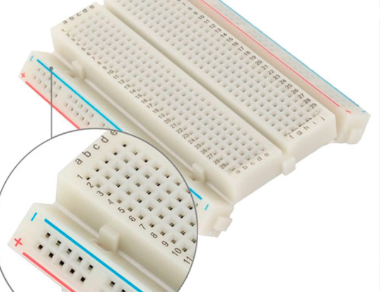
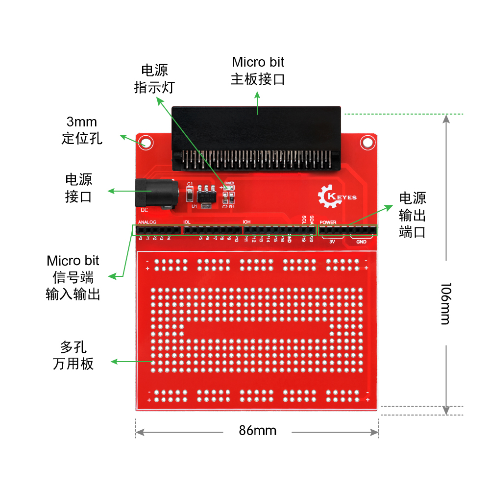
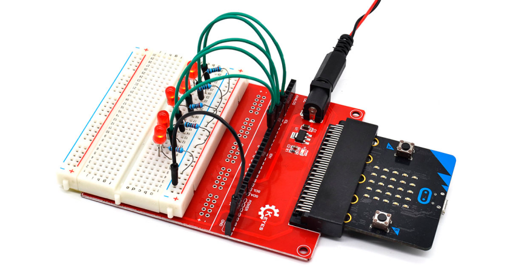
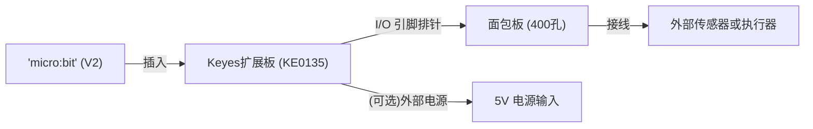

# KE0135 Keyes micro:bit 原型扩展板 V2 (含400孔面包板)

## 1. 介绍
**KE0135 Keyes micro:bit 原型扩展板 V2** 是专为 BBC micro:bit 设计的多功能扩展板，带有 400 孔面包板，可便捷地进行电路原型搭建和实验。板面采用红色环保 PCB 制作，不仅外观美观且符合环保工艺标准。  
通过将 micro:bit 插入该扩展板，用户可在面包板上快速连接各种传感器、LED、按键等外设，广泛应用于学生创客教育、电子原型设计、智能小车或机器人等项目研发。

---

## 2. 特点
1. **专用卡槽**  
   - 面向 micro:bit (V1 或 V2) 设计，金手指插槽稳定牢固，大大简化接线。
   
   	
   
2. **400 孔面包板**  
   - 与扩展板紧密配合，拥有充足的焊盘区域，支持多模块同时实验。
   
   	
   
3. **电源灵活**  
   
   - 默认从 micro:bit USB 供电 (3.3V)，部分版本可外接 5V 电源以驱动更多外设。
   
4. **接口丰富**  
   - 板载常用 I/O、I2C、SPI、UART 等接口，有充足排针可用来连接各种电路。
   
5. **红色环保 PCB**  
   - 外观醒目、生产过程使用环保材料，符合电子环保标准。

---

## 3. 规格参数
- **兼容主板**：BBC micro:bit V1 / V2  
- **扩展板尺寸**：约 80×60 mm (不含面包板)  
- **面包板**：400 孔 (带电源轨)  
- **工作电压**：默认 3.3V (由 micro:bit 提供)；部分版本可配置 5V 输入  
- **接口标准**：2.54mm 间距排针，适合杜邦线、各类传感器/模块  
- **负载能力**：取决于 micro:bit 或外接电源的输出，通常适合小功率传感器与控制器  
- **适用场合**：STEM 教育、创客实验、原型设计、电子开发等

---

## 4. 工作原理
micro:bit 通过插槽与扩展板进行电气连接，扩展板则将 micro:bit 各 I/O 引脚分配到排针和面包板电路区域，使得用户可以：
1. 将电源 (3.3V/5V) 和地线 (GND) 引到面包板供电轨；  
2. 将需要的信号线从插针引至面包板对应行列；  
3. 随意添加各种元器件（LED、电阻、传感器模块等），搭建电路并与 micro:bit 进行数据交互；  
4. 借助 micro:bit 的程序编写，实现对外设的读取或控制。

---

## 5. 接口一览
1. **micro:bit 专用插座**  
   - 将 micro:bit 的金手指插入此插座，注意方向 (LED 显示面朝外)。  
2. **I/O 排针**  
   - 各种 I/O (如 P0~P20) 均有标识，方便定位；支持多通信接口 (I2C、SPI、UART)。  
3. **电源排针**  
   - 提供 3.3V、GND，以及部分版本可切换至 5V；  
4. **面包板**  
   - 标准 400 孔：主体实验孔 + 电源轨 (+ / -)，方便各组件插接；  
5. **方型固定孔**  
   - 便于将扩展板固定在机器人或其他结构件上，具体留意螺丝规格。

---

## 6. 连接图

以下以示意形式说明 micro:bit 与扩展板、面包板及外接模块的关系：  

- 将 micro:bit 插入扩展板插槽  
- 从扩展板引脚连接面包板，再根据实验需要，将传感器/LED/电机驱动等模块插在面包板上  
- 若项目需要更大功率，可另行接入 5V 电源口 (按版本支持情况)

---

## 7. 示例代码
以一个简单的 LED 闪烁测试为例：  
1. 在面包板上接好 LED 与电阻 (串联约 220Ω)，正极连扩展板 P0，引脚，负极连 GND； 
2. 在 MakeCode (或其他 micro:bit IDE) 中编写以下逻辑：  

<iframe style="position:absolute;top:0;left:0;width:100%;height:100%;" src="https://makecode.microbit.org/#pub:_1PuVa0dybCMk" frameborder="0" sandbox="allow-popups allow-forms allow-scripts allow-same-origin"></iframe>

- 保存/下载 `.hex` 文件到 micro:bit 即可运行  
- 每隔 1 秒观察 LED 亮灭

---

## 8. 实验现象
- **LED 闪烁**：如示例中提到的 LED 每隔 1 秒闪一次；  
- **传感器可读**：若连接了光敏、温度等传感器，则在 micro:bit 的程序监控中获得对应数据，实时显示或上传；  
- **多元件协作**：可在面包板上同时接入多个模块，实现更加复杂的交互试验 (如温湿度显示、声音检测、蜂鸣器报警等)。

---

## 9. 注意事项
1. **正确插入方向**：micro:bit 要保证金手指与扩展板插座方向一致，LED 和按键面向外侧；  
2. **电源防护**：若外接 5V 电源，务必查明极性与电压范围；避免与 micro:bit 的 3.3V 直接冲突；  
3. **避免短路**：在面包板上布线时，谨防正负极或信号与地线直接短路；  
4. **静电保护**：在操作电路前尽量触摸金属物放电，或佩戴防静电手环；  
5. **功率限制**：micro:bit 自身输出电流有限，如需带动马达、舵机等大功率设备，需使用外部电源或驱动板。

---

## 10. 参考链接
- **官方网站**  
  - [micro:bit 官方](https://microbit.org/)  
  - [MakeCode 在线编程](https://makecode.microbit.org/)  
- **Keyes 相关链接**  
  - [Keyes 官网](http://www.keyestudio.com)  
  - [Keyes 天猫旗舰店](https://keyes.tmall.com/)  
- **开发资料**  
  - [Mu Editor](https://codewith.mu/) (micro:bit Python 编程)  