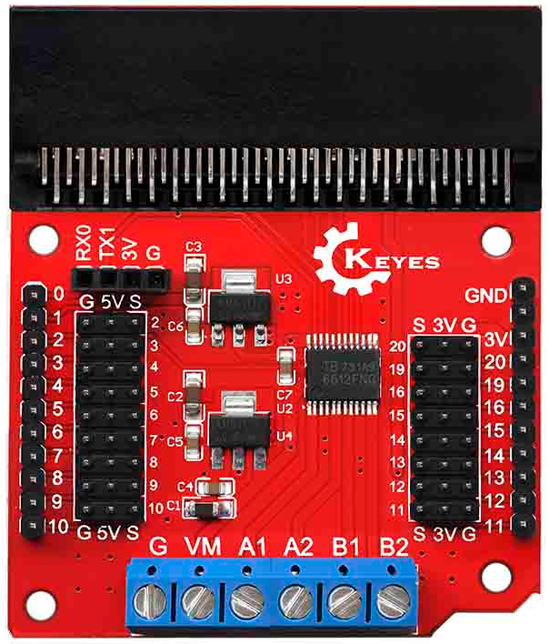
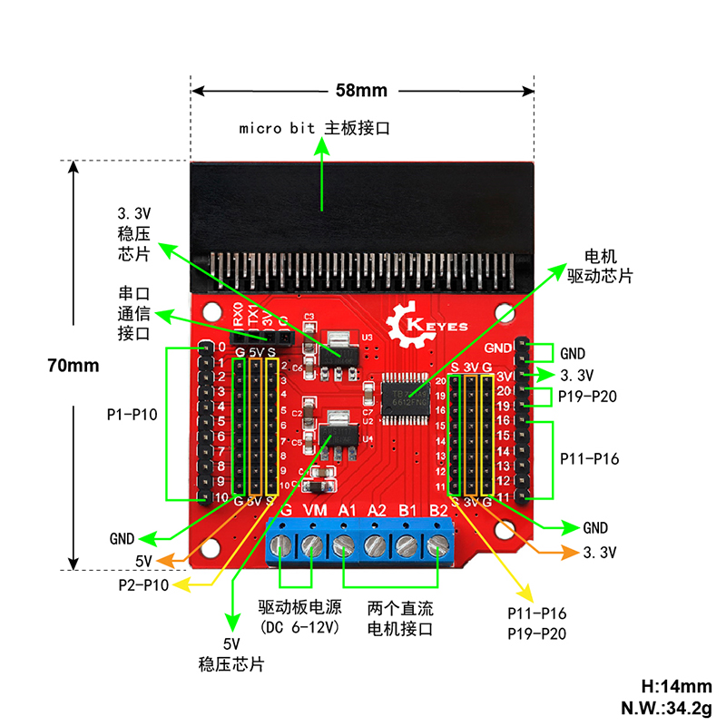
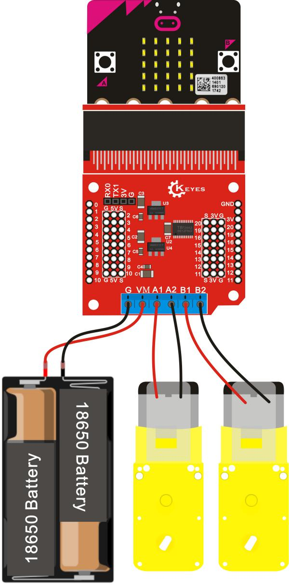
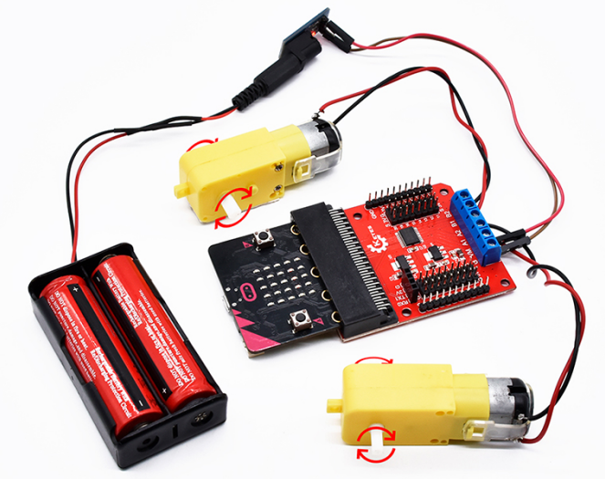

# KE0136 Keyes micro:bit 电机驱动扩展板 (红色环保)



## 1. 介绍
**Keyes micro:bit 电机驱动扩展板 (KE0136)** 专为 BBC micro:bit 设计，采用 **TB6612FNG** 驱动芯片，能驱动两路直流电机或一部步进电机，适合智能小车、机械臂及其他对运动控制有需求的创客项目。本扩展板配备 **3.3V / 5V 稳压输出** 及 **3PIN 接口**，方便拓展传感器和通信模块；板面使用 **红色环保 PCB** 工艺，品质优良且美观。

**micro:bit** 是由英国广播电视公司（BBC）为青少年编程教育打造的入门开发板，可使用微软推出的 PXT 图形化编程环境 (MakeCode), 在多平台 (Windows、macOS、iOS、安卓等) 下无需下载编译器即可快速入门。

---

## 2. 特点
1. **多路电机输出**  
   - 2 路直流电机输出，支持正转、反转、制动、停止等模式，PWM 频率最高可达 100 kHz。  
2. **高电流驱动**  
   - TB6612FNG 芯片每通道连续输出可达 1.2A，启动峰值电流可达 2A/3.2A，能满足多数小型车与步进电机需求。  
3. **丰富接口**  
   - 通过 3PIN (VCC/GND/Signal) 引出 micro:bit 引脚；另提供串口通信接口，方便连接蓝牙模块或其他串口设备。  
4. **稳压电源**  
   - 板载 3.3V 与 5V 稳压芯片，可同时为 micro:bit、本扩展板及其他外设供电。  
5. **环保工艺**  
   - 采用红色环保 PCB，兼具美观与耐用性，符合绿色生产标准。  

---

## 3. 规格参数
- **输入电压**：DC 6~12V (建议根据所用电机额定电压选择)  
- **驱动电流**：单通道连续工作电流 ≤ 1.2A  
- **峰值电流**：启动或短时峰值可达 2A / 3.2A  
- **驱动芯片**：TB6612FNG (双路 H 桥驱动)  
- **尺寸**：约 70mm × 58mm  
- **兼容主板**：BBC micro:bit (V1 / V2)  
- **接口方式**：3PIN 接口 + 电机端子 + 串口引出 + 外部电源端子  
- **工作环境**：-10℃ ~ +50℃  

---

## 4. 工作原理
1. **信号传输**  
   - micro:bit 插入扩展板后，其 GPIO、PWM、串口等信号经板上电路转接至驱动芯片输入端；  
2. **电机控制**  
   - TB6612FNG 根据来自微控制器的控制信号 (IN1/IN2/PWM) 产生对应的直流电机驱动输出，可实现正转、反转、刹车、停止等；  
3. **电源分配**  
   - 外部 6~12V 为电机供电，并经稳压电路提供 3.3V/5V 输出给 micro:bit 及其他扩展功能模块；  
4. **扩展应用**  
   - 通过 3PIN 接口可将更多传感器、蓝牙模块或其他通信设备与 micro:bit 连接，实现智能控制或无线数据传输。  

---

## 5. 接口说明
1. **micro:bit 插槽**  
   - 将 micro:bit 主板 (金手指端) 垂直插入扩展板插座，注意方向应使 micro:bit LED 显示面朝外。  
2. **电机端子 (M1、M2)**  
   - 用于连接两路 DC 电机或一部步进电机 (需按正确相序接线)；  
3. **外部电源接口**  
   - DC 插孔或端子 (具体版本不同) 接入 6~12V 电源，为电机和板上电路供电；  
4. **3PIN 引脚接口**  
   - 将 micro:bit 常用 GPIO、I2C、SPI、串口等信号通过 3PIN (VCC/GND/Signal) 引出，方便快速插线。  
5. **串口接口**  
   - 提供 RX/TX 二线端口，可直接插接蓝牙模块或其他串口模块；  
6. **电源选择/稳压电路**  
   - 板上有 3.3V/5V 输出，引脚通常标识 3V / 5V / GND，用杜邦线可为传感器或小功率模块供电。



---

## 6. 连接图
下面简要展示 micro:bit 与扩展板、直流电机和输入电源之间的逻辑连接：
1. micro:bit 通过扩展板插槽与驱动芯片连接；  
2. M1、M2 将直流电机接出；  
3. 外部电源输入 6~12V，驱动电机并经稳压供给 micro:bit；  
4. 可选接更多传感器或通信模块，提供 3.3V/5V 及串口等资源。



---

## 7. 示例代码
以下示例基于 MakeCode 块状编程或 Python，示意两个 DC 电机分别正转与反转，间隔 3 秒循环。

**MakeCode 代码示例**  

<div style="position:relative;height:0;padding-bottom:70%;overflow:hidden;"><iframe style="position:absolute;top:0;left:0;width:100%;height:100%;" src="https://makecode.microbit.org/#pub:_36C1KpaKeYC3" frameborder="0" sandbox="allow-popups allow-forms allow-scripts allow-same-origin"></iframe></div>

**MicroPython 示例**  
```python
from microbit import *
import time

while True:
    # 正转
    pin8.write_digital(0)
    pin12.write_digital(0)
    pin0.write_analog(1023)
    pin1.write_analog(1023)
    time.sleep(3)

    # 反转
    pin8.write_digital(1)
    pin12.write_digital(1)
    pin0.write_analog(1023)
    pin1.write_analog(1023)
    time.sleep(3)
```

---

## 8. 实验现象



- 上传代码并上电后，两个电机会先 **正转 3 秒**，然后 **反转 3 秒**，如此循环；  
- 随着占空比 (analogWritePin 数值) 的变化，电机转速相应变化；  
- 更改方向引脚电平，可观察到电机切换正反转状态；  
- 如果添加传感器或舵机等外设，可在 micro:bit 程序中读取数据或进行更多复合控制。

---

## 9. 注意事项
1. **方向检查**：插 micro:bit 时，确保金手指对准插槽；  
2. **电压范围**：外部电源应选 6~12V 并符合所用电机的额定电压；  
3. **功率限制**：如电机功率过大，请检查峰值电流是否超出 TB6612FNG 驱动能力；  
4. **防短路**：接线需留意正负极，谨防电机线与电源线接反；  
5. **静电保护**：插拔 micro:bit 前尽量在无静电环境下操作；  
6. **散热**：若长时间大电流驱动，注意驱动芯片和电路板温度，必要时需做散热处理。

---

## 10. 参考链接
- **官方资料**  
  - [micro:bit 官方](https://microbit.org/)  
  - [MakeCode 在线编程](https://makecode.microbit.org/)  
- **Keyes 官网上商城**  
  - [Keyes 官网](http://www.keyestudio.com)  
  - [Keyes 天猫旗舰店](https://keyes.tmall.com/)  
- **开发相关**  
  - [Mu Editor](https://codewith.mu/) (在 micro:bit 上进行 Python 编程)  
  - [Arduino 在线资源](https://www.arduino.cc/) (有助于理解通用电子与编程思路)

如有更多技术需求，可与 Keyes 官方客服或社区交流。祝使用愉快！