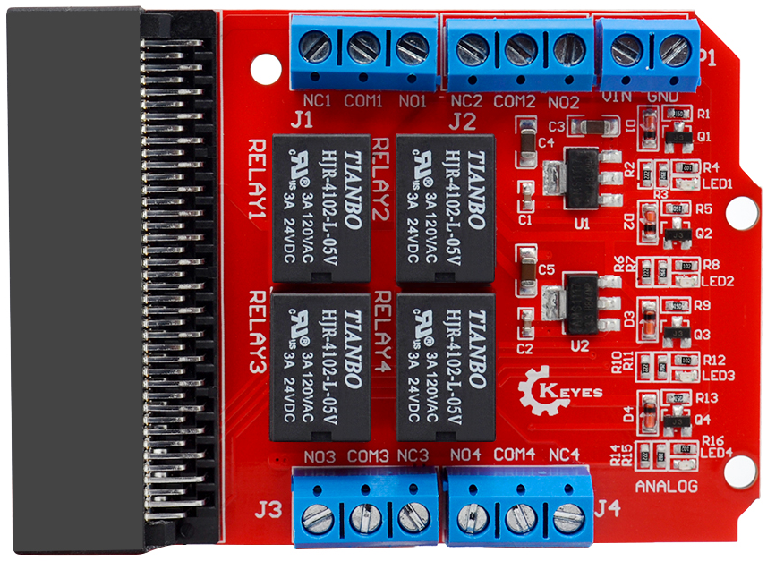
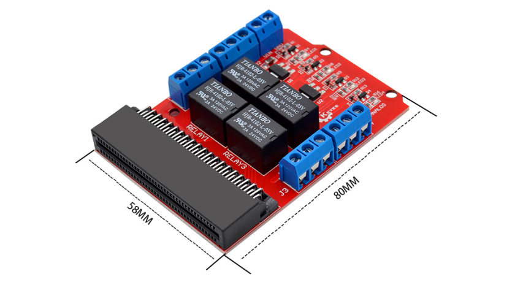
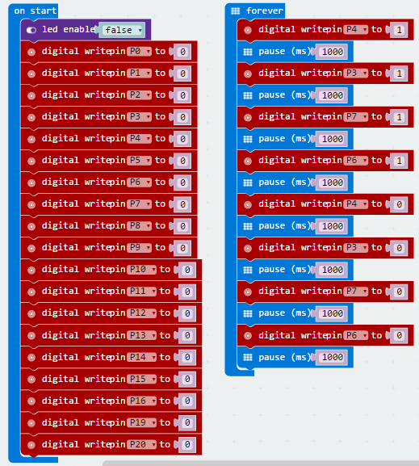
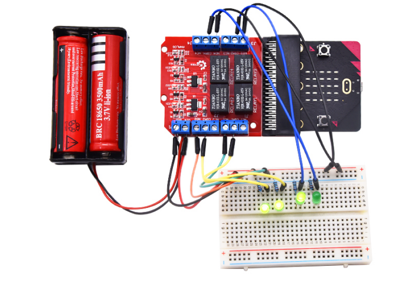

# KE0137 Keyes micro:bit 继电器扩展板 (红色环保)



## 1. 介绍
**Keyes micro:bit 继电器扩展板** 将 4 路 5V 继电器模块整合至一块电路板，兼容 BBC micro:bit 开发板。只需将 micro:bit 插入扩展板，并在继电器 VIN、GND 端口输入 5V 电源，即可方便地控制 4 路继电器，实现对高电压或大电流负载的开关控制。  
继电器均为 **高电平有效**，分别与 micro:bit 的 P4、P3、P7、P6 相连，通过在程序中控制这些引脚的高低电平即可实现继电器吸合/断开的切换。

**micro:bit** 是由 BBC（英国广播电视公司）为青少年编程教育设计的入门级开发板。它支持微软开发的 PXT（MakeCode）图形化编程环境，可在 Windows、macOS、iOS、安卓等多种操作系统下使用，不需另外下载编译器即可快速上手。

---

## 2. 特点

1. **4 路独立继电器**  
   - 每一路继电器均可单独控制，方便实现多路负载的独立开关。  
2. **高电平有效**  
   - 4 路继电器控制端分别连接到 P4、P3、P7、P6；只需输出高电平即可吸合继电器。  
3. **一体式插槽**  
   - micro:bit 通过垂直插入扩展板连接，减少杜邦线连接的繁琐和误插风险。  
4. **提供 5V 输入**  
   - 只需在板载的 VIN/GND 上输入 5V，即可为 4 路继电器线圈供电；微控制器与继电器由光耦或驱动电路隔离 (依板载方案而定)，确保安全稳定。  
5. **红色环保 PCB**  
   - 采用红色环保工艺，外观美观，制造过程符合环保标准，板面布局合理，焊点牢固。

---

## 3. 规格参数
- **输入电压**：DC 5V (继电器线圈工作电压)  
- **工作方式**：高电平有效 (约 3.3V~5V；由 micro:bit 引脚控制)  
- **触点容量**：  
  - AC 120V / 3A  
  - DC 24V / 3A  
  *(具体请根据继电器本身标识为准)*  
- **继电器控制引脚**：micro:bit 的 P4、P3、P7、P6  
- **板子尺寸**：约 70mm × 58mm (参考实际产品)  
- **适配主控**：BBC micro:bit (V1 / V2)



---

## 4. 工作原理
1. **GPIO 控制**  
   - micro:bit 的 4 个 GPIO (P4、P3、P7、P6) 连到继电器驱动电路。当某个引脚输出高电平时，该路继电器线圈得电吸合；低电平时继电器释放。  
2. **继电器开关**  
   - 每个继电器具备 COM、NO、NC (公共端、常开端、常闭端) 三个触点，可根据场景将负载串接在常开或常闭触点上，实现对外部设备的开关控制。  
3. **电源供应**  
   - 扩展板上继电器的线圈电压为 5V，需要通过扩展板的 VIN、GND 端口提供 5V 输入，保证继电器正常工作。micro:bit 供电部分则可通过其 micro USB 接口独立供电。

---

## 5. 接口说明
1. **micro:bit 插槽**  
   - 垂直插入 micro:bit 主板，注意金手指和插槽对应；micro:bit 上 LED 显示面与扩展板标识面同向。  
2. **继电器 1~4**  
   - 对应 4 个独立继电器，一般标有 CH1、CH2、CH3、CH4；根据板上丝印可识别各路的 COM、NO、NC 端子。  
3. **5V 电源输入**  
   - 通过 VIN（+5V）和 GND 端子，为整个继电器扩展板提供电流支撑。  
4. **控制引脚**  
   - P4、P3、P7、P6 与 4 路继电器对应，来自 micro:bit GPIO。  
5. **其他引脚** *(可选)*  
   - 一些版本可能预留 3.3V、5V 或其他扩展接口，便于连接其它传感器模块。

---

## 6. 连接图
下面展示4路继电器控制简单LED负载逻辑示例：

1. micro:bit 插在扩展板上，不再繁琐走线；  
2. 5V 电源输入到扩展板 VIN、GND；  
3. 4 路继电器各自的 COM、NO、NC 端子接到相应的负载，例如指示灯、小型电机或报警器等；  
4. 控制引脚 P4、P3、P7、P6 输出高电平时，对应继电器吸合，负载得电工作。

---

## 7. 示例代码
以下示例基于 MakeCode，演示 4 路继电器依次吸合 1 秒，再释放 1 秒，循环往复。



*MicroPython* 调用类似：
```python
from microbit import *
import time

relay_pins = [pin4, pin3, pin7, pin6]
delay_time = 1  # 1 秒

while True:
    # 依次吸合
    for p in relay_pins:
        p.write_digital(1)
        time.sleep(delay_time)
    # 依次释放
    for p in relay_pins:
        p.write_digital(0)
        time.sleep(delay_time)
```

---

## 8. 实验现象
- 将 micro:bit 插在扩展板上，并连接好 5V 电源和相应负载后。  

- 当运行上述代码时，4 路继电器会先后“咔哒”吸合，每路间隔 1 秒，然后依次释放，形成明显的循环切换。  

- 若有外接指示灯或其它负载，可看到其对应继电器吸合时亮起（或启动），释放时关闭。

	

---

## 9. 注意事项
1. **供电安全**：要保证 5V 电源稳压能力足够，注意正负极不要接反；  
2. **用电规范**：继电器可切换高压大电流负载时，务必遵守安全规范；  
3. **插板方向**：micro:bit 金手指需对准扩展板插槽方向而插，如反向可能损坏主板；  
4. **高电平有效**：控制引脚设置为 1 时，继电器吸合；为 0 时，继电器断开；  
5. **触点规格**：AC 120V / 3A 或 DC 24V / 3A 等，超出范围将损坏继电器或造成安全隐患；  
6. **注意电磁干扰**：继电器频繁切换时可能产生电磁噪声，如需更高稳定性可加滤波或栅极保护电路。

---

## 10. 参考链接
- **官方资料**  
  - [micro:bit 官方](https://microbit.org/)  
  - [MakeCode 在线编程](https://makecode.microbit.org/)  
- **Keyes 相关**  
  - [Keyes 官网](http://www.keyes-robot.com)  
- **开发资料**  
  - [Mu Editor](https://codewith.mu/) (在 micro:bit 上使用 Python 编程的编辑器)  
  - [Arduino 资源](https://www.arduino.cc/) (有助于理解一般电子编程思路与示例)
