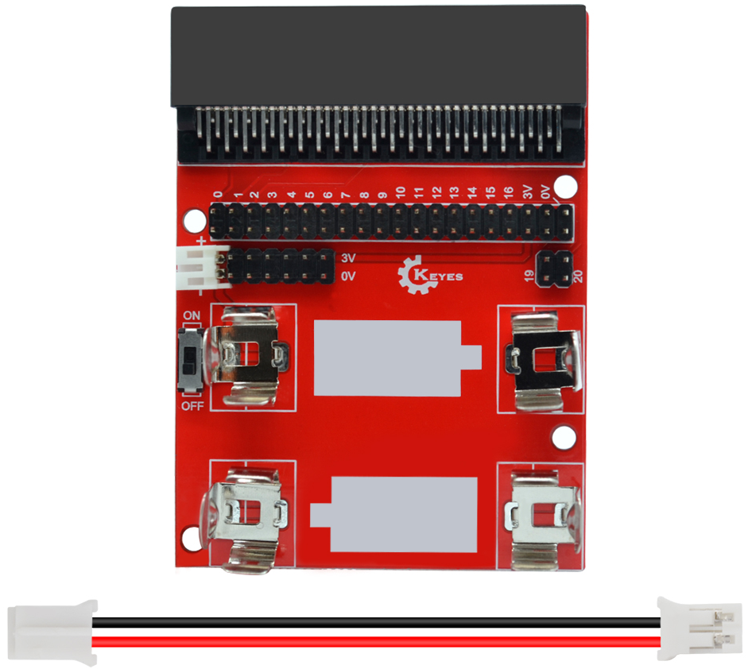
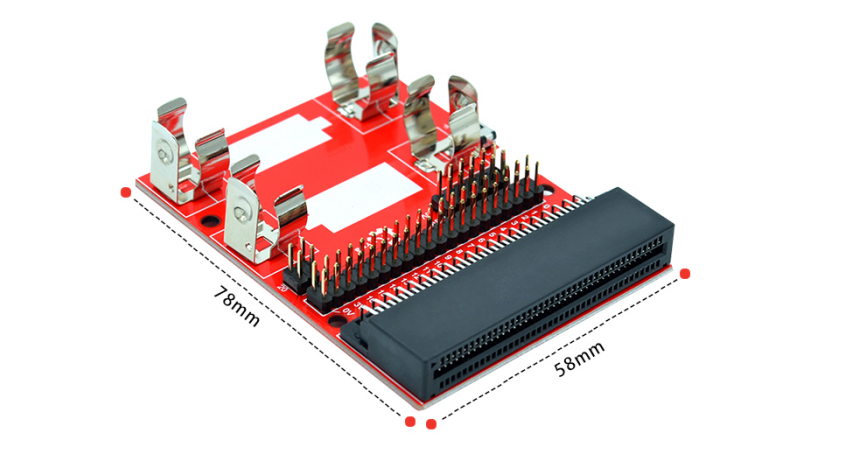
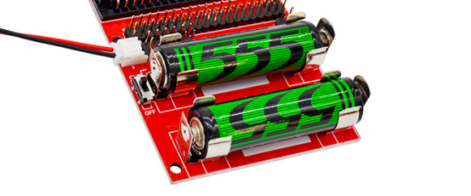
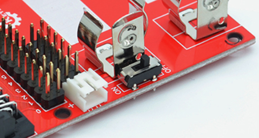
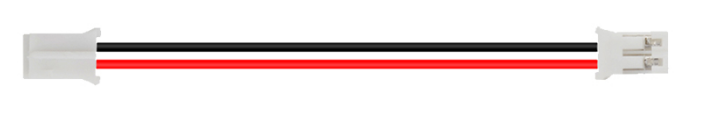
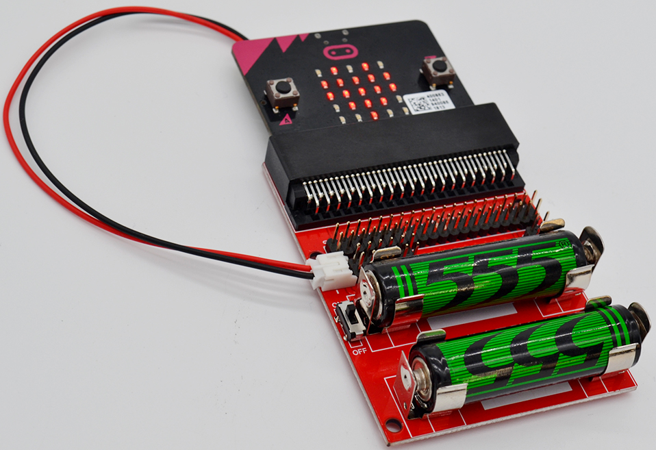

# KE0138 Keyes micro:bit 电源供应扩展板 (红色环保)

---

## 1. 介绍
**Keyes micro:bit 电源供应扩展板（KE0138）**专为 BBC micro:bit 开发板打造，可轻松为 micro:bit 提供 3V 电源。板载两个 5 号电池槽（AA，每节 1.5V），通过串联方式输出约 3.0V；内置一个拨码开关，用于控制电池电源通断，无需频繁拔插电池。此扩展板通过 **JST-PH2.0mm 2P** 接口与 micro:bit 连接，简化了接线并更好地保证安全与稳定性。

**micro:bit** 是由英国广播电视公司（BBC）设计的入门级开发板，适用于青少年编程教育与创客项目。它支持微软推出的 PXT (MakeCode) 图形化编程环境，可在多种操作系统 (Windows、macOS、iOS、安卓) 下使用，无需安装额外编译工具。

---

## 2. 特点
1. **双电池供电**  
   - 可内置两节 5 号电池(AA，每节 1.5V)，串联形成稳定的 3V 输出，满足 micro:bit 的默认供电要求。  
2. **拨码开关控制**  
   - 一键通断电源，避免不必要的电量消耗，提高操作方便性。  
3. **JST-PH2.0mm 2P 接口**  
   - 采用标准化的供电插头与线缆连接 micro:bit，防止接线错误，提高使用可靠度。  
4. **稳定可靠**  
   - 整体采用红色环保 PCB，设计合理，经久耐用，占用空间小；适合户外教学演示或课堂时的移动供电。  

---

## 3. 规格参数
- **产品型号**：KE0138  
- **PCB 尺寸**：约 78mm × 58mm × 20mm  
- **电池数量**：2 节 5 号电池 (AA)，每节 1.5V  
- **线缆长度**：约 170mm (JST-PH2.0mm 2P 线)  
- **输入电压**：DC 3V (两节 AA 电池串联)  
- **开关类型**：拨码开关 (ON/OFF)

---

## 4. 工作原理
1. **电池串联**  
   - 扩展板将两节 5 号电池串联，输出约 3.0V，为 micro:bit 开发板提供稳定低压。  
   
   	
   
2. **电源切换**  
   - 板载拨码开关位于电池输出端，置于 “OFF” 时切断电源，置于 “ON” 时连通电路；  
   
   	
   
3. **供电接线**  
   - 扩展板的 JST-PH2.0mm 接口通过电源线连接 micro:bit 板上的电源插口 (若有此接口)；若使用其他扩展板方式也可根据电压需求自行接线。
   
   	

---

## 5. 接口说明
1. **电池槽**  
   - 两个可容纳 AA(5 号) 电池的槽，注意正负极方向保持一致；  
2. **拨码开关**  
   - 在扩展板正面，控制电源通断；  
3. **JST-PH2.0mm 输出口**  
   - 连接到 micro:bit 的电源输入端；  
4. **固定孔** *(可选)*  
   - 若板上留有固定螺丝孔，便于安装在创客项目或教学平台上。

---

## 6. 连接图
以下展示使用电池扩展板给 micro:bit 直接供电的简要示意：

1. 将正确极性的电池插入电池槽；  
2. 拨码开关置于 “OFF” 后再将 JST-PH2.0mm 接口连接到 micro:bit；  
3. 拨到 “ON” 即可向 micro:bit 提供 3V 供电。

---

## 7. 示例代码
假设已经给 micro:bit 上传了简单的示例程序，如让 LED 闪烁或滚动显示文字。  
在此扩展板供电时，程序会自动运行。以下为一段最常见的 MakeCode 闪烁示例：

<iframe style="position:absolute;top:0;left:0;width:100%;height:100%;" src="https://makecode.microbit.org/#pub:_bmLCYTTKJhXw" frameborder="0" sandbox="allow-popups allow-forms allow-scripts allow-same-origin"></iframe>

当电源拨码开关 “ON”，micro:bit 处于供电状态，LED 阵列会上下闪烁心形。

---

## 8. 实验现象
- 当 `ON` 打开电源开关时，micro:bit 立即启动并显示程序中设定的图案或文字；  
- 切换至 `OFF` 时，micro:bit 随即失去供电而停止工作；  
- 注意电池电量下降时 LED 亮度会降低，或发生复位现象；此时可更换或补充电池供电。

---

## 9. 注意事项
1. **极性正确**：安装电池时务必注意正极与负极朝向符合电池槽标识；  
2. **拨码开关**：长时间不用时应切换 “OFF” 断电，防止电池过度放电；  
3. **线缆安全**：勿强力拉扯 JST 接口或线缆，避免接触不良；  
4. **兼容电池**：若使用镍氢充电电池(NiMH)，单节约 1.2V，需要评估对 micro:bit 电压是否足够；  
5. **环境温度**：电池电压在低温环境下降幅度大，野外使用时可考虑暖袋或备用电池；  
6. **回收与环保**：用完的电池应妥善回收或处理，保护环境。

---

## 10. 参考链接
- **官方文档**  
  - [micro:bit 官方网站](https://microbit.org/)  
  - [MakeCode 在线编程](https://makecode.microbit.org/)  
- **Keyes 相关**  
  - [Keyes 官网](http://www.keyes-robot.com)  
- **开发辅助**  
  - [Mu Editor](https://codewith.mu/) (micro:bit Python 编程环境)  
  - [Arduino 官方](https://www.arduino.cc/) (可参照其他开发板的一般电子知识)

