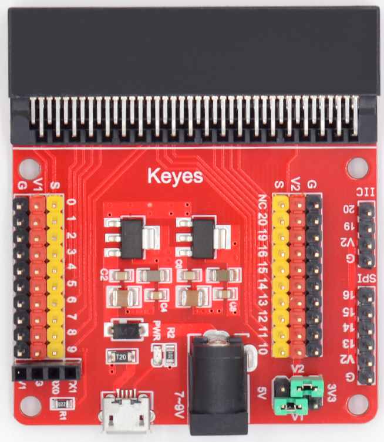
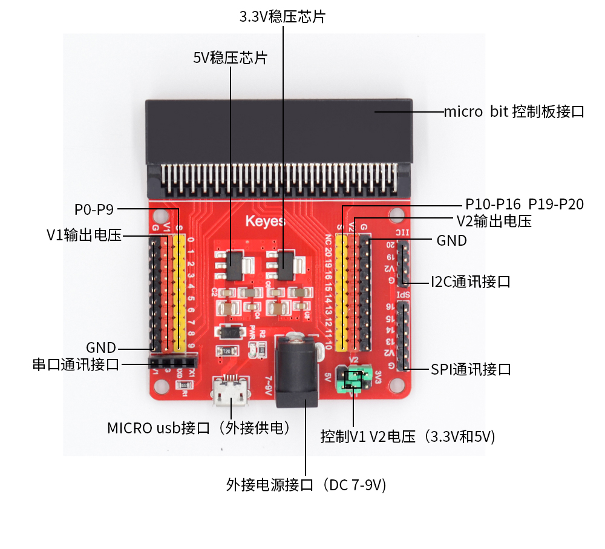
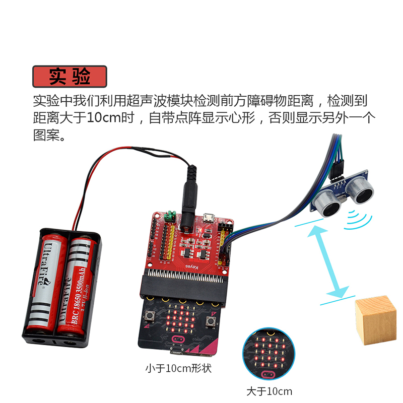

# KE0139 Keyes micro:bit 传感器V2扩展板 (红色环保)

## 1. 介绍
**Keyes micro:bit 传感器V2扩展板** 针对 micro:bit 在连接多种传感器或外设时所面临的布线复杂、不便调试等问题而设计。板上不仅将 micro:bit 的所有 PIO (GPIO) 引脚扩展为 3PIN 接口（包含 GND、VCC、Signal），便于快速连接常见的三线制传感器；同时还将 **UART、I2C、SPI** 等常用通信接口以 2.54mm 间距排针/排母方式引出，方便与更多外设、显示屏、通信模块进行连线。  
该扩展板支持 **两种电源输入方式**（黑色 DC 头或 micro USB 接口），并可通过 V1、V2 跳线帽选择为传感器提供 **3.3V 或 5V** 的工作电压。板上带有稳定���源芯片 AMS1117-3.3V 和 NCP1117ST50T3G，注意当外接负载较大时它们会发热，使用时避免触碰芯片以防烫伤。

---

## 2. 特点
1. **双电源输入**  
   - **黑色 DC 头**：可输入 DC 7~9V。  
   - **micro USB**：可输入 DC 5V。  
2. **双电源输出选择**  
   - 通过 **V1、V2 跳线帽** 可选择对传感器输出 **3.3V 或 5V** 电压，进一步拓展适配不同电压需求的传感器/模块。  
3. **PIO 全部扩展为 3PIN 接口**  
   - 直接对应 micro:bit 控制板的所有 GPIO 引脚，每个包含 GND、VCC、Signal，极大简化插拔和调试。  
4. **丰富接口**  
   - 板载 1 个 **UART 接口**、1 个 **I2C 接口**、1 个 **SPI 接口**（2.54mm 排针/排母），方便与其他通信设备连接。  
5. **电源指示灯**  
   - 上电时自动点亮，方便确认电源状态。  
6. **人性化设计**  
   - 采用 **红色环保 PCB**，耐用美观，布局清晰，尺寸适合教学或创客项目使用。

---

## 3. 规格参数
- **产品型号**：KE0139  
- **尺寸**：约 65mm × 56mm
- **重量**：约 31g  
- **输入电压**：  
  - DC 7~9V（通过黑色 DC 头）  
  - DC 5V（通过 micro USB 接口）  
- **输出电压**：通过跳线帽选择 3.3V 或 5V 给传感器供电  
- **兼容控制器**：micro:bit (V1 / V2)  
- **板载芯片**：AMS1117-3.3V、NCP1117ST50T3G (5V 稳压)  
- **接口资源**：  
  - PIO 扩展：全部 micro:bit GPIO 转为 3PIN (GND、VCC、SIG)  
  - UART、I2C、SPI：2.54mm 间距排针/排母

---

## 4. 工作原理
1. **供电转换**  
   - 当输入 DC 7~9V（或 5V）后，板上的 AMS1117-3.3V 和 NCP1117ST50T3G 稳压芯片会产生分别约 3.3V、5V 输出，通过跳线帽 (V1、V2) 选择对传感器模块供电。  
2. **IO 引脚转接**  
   - micro:bit 控制板通过金手指连接到扩展板后，所有的 PIO（GPIO）信号引出到 3PIN 接口；其中 VCC 可以通过扩展板的跳线设置为 3.3V 或 5V，GND 为公共地，Signal 为对应的数字或模拟引脚。  
3. **通信接口**  
   - 板载的 UART、I2C、SPI 通过排针/排母引出，与 micro:bit 自带的通信总线对应，使得外部模块、传感器或显示器能够方便连线并进行数据传输。

---

## 5. 接口说明

1. **micro:bit 插槽**  
   - 垂直插入 micro:bit 主板时，确保金手指对准扩展板插槽；正面标识一致。  
2. **3PIN 排针**  
   - 对应 micro:bit 各 GPIO：如 P0、P1、P2 等，每个接口由 GND、VCC、SIG 构成。  
3. **UART / I2C / SPI**  
   - 板上对应 silk 标识为 TX、RX (UART)；SDA、SCL (I2C)；MOSI、MISO、SCK 等 (SPI)，分别采用 2.54mm 间距排针/排母。  
4. **电源输入**  
   - **黑色 DC 头**：DC 7~9V；  
   - **micro USB 接口**：提供 DC 5V；  
5. **电源选择跳线 (V1, V2)**  
   - 通过插拔跳线帽，选择向 3PIN 接口输出 3.3V 或 5V。一般 [3.3V | 5V] 两组端子配合说明书旋转或刺字来区分。  
6. **电源指示灯**  
   - 当扩展板获得正确供电时会亮起指示灯，便于确认电路上电状态。

---

## 6. 连接图
以下示意将 micro:bit 开发板插入扩展板，通过黑色 DC 头输入 7~9V，为传感器供电 5V 的连接逻辑：

1. 将 micro:bit 有 LED 显示的一面朝外插入扩展板；  
2. 选择 V1、V2 跳线帽位置到 5V；  
3. 黑色 DC 头输入 7~9V；  
4. 用杜邦线将传感器或外设连接到对应的 3PIN 接口或通信排针上。

---

## 7.超声波传感器示例代码

<iframe style="position:absolute;top:0;left:0;width:100%;height:100%;" src="https://makecode.microbit.org/#pub:_38HRDh47d1MK" frameborder="0" sandbox="allow-popups allow-forms allow-scripts allow-same-origin"></iframe>

## 8. 实验现象

1. **电源与指示灯**：通电后，扩展板上的电源指示灯亮起，micro:bit 正常运行。
2. **距离测量**：当超声波传感器检测到前方物体的距离时：
   - 当距离小于 10cm 时，显示心形图案，指示物体靠近。
   - 当距离大于或等于 10cm 时，显示方块图案，指示物体距离较远。
3. **实时反馈**：LED 显示图案随距离变化实时更新，方便直观观察。

---

## 9. 注意事项
1. **板载稳压芯片过热**：当负载较大时，请注意芯片的温度上升，勿直接触碰以防烫伤。若温度过高，可考虑加装散热片或降低外接模块功耗。  
2. **电源选择跳线**：务必根据传感器或外设需求正确选择 3.3V 或 5V；如果传感器不支持 5V 而错误接 5V 可能损坏器件。  
3. **电源输入范围**：黑色 DC 头建议使用 7~9V 适配器，不要超出范围。若只需微电流或简单场景，可选 USB 5V 供电。  
4. **插拔 micro:bit**：应先断电再插拔，防止静电或瞬时编程口短路造成损坏。  
5. **连线牢固**：3PIN 接口、UART/I2C/SPI 接口均应使用正确的线序(GND、VCC、Signal)，杜邦线勿插松脱。  
6. **安全用电**：注意保持实验环境干燥整洁，避免意外短路、反接等情形。

---

## 10. 参考链接
- **官方文档**  
  - [micro:bit 官方](https://microbit.org/)  
  - [MakeCode 在线编程](https://makecode.microbit.org/)  
- **Keyes 相关**  
  - [Keyes 官网](http://www.keyes-robot.com/)  
- **开发辅助**  
  - [Mu Editor](https://codewith.mu/) (micro:bit Python 编程环境)  
  - [Arduino 官方](https://www.arduino.cc/) (可参考一般电子开发资料)

如有更多疑问，可联系 Keyes 官方客服或加入相关创客社区交流。祝使用愉快！