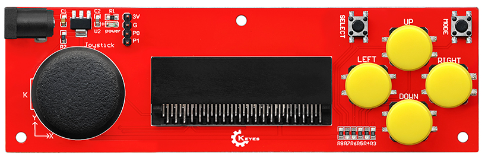
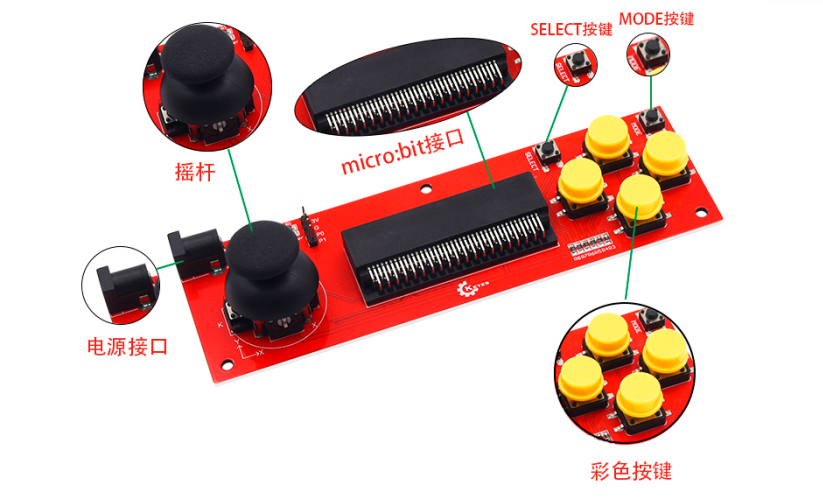
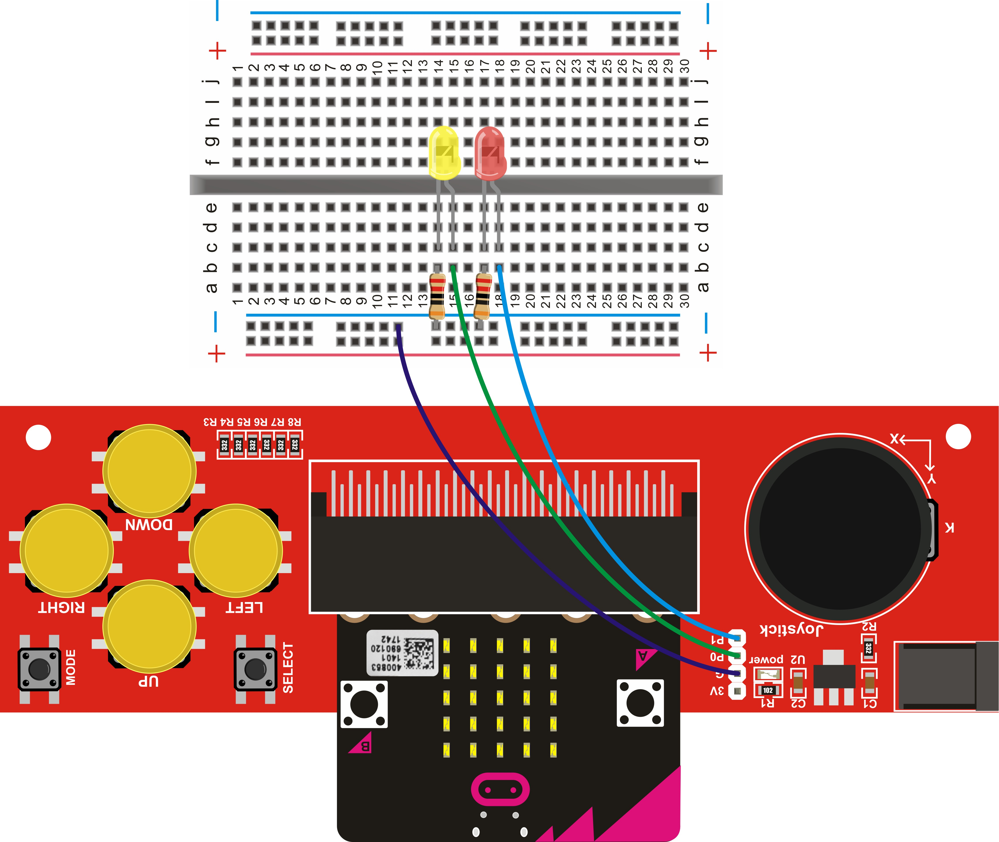
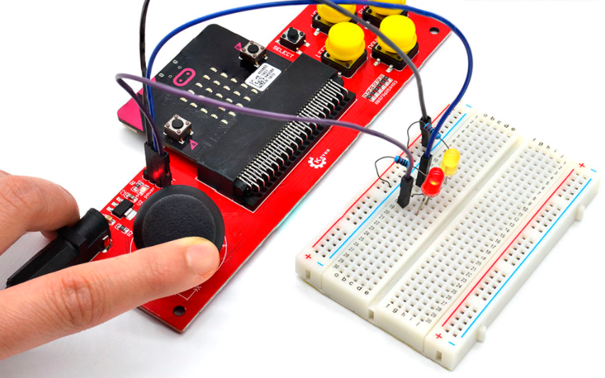

# KE0140 Keyes micro:bit 摇杆扩展板 (红色环保)

---

## 1. 介绍
**Keyes micro:bit 摇杆扩展板** 是为 BBC micro:bit 开发板设计的扩展模块，旨在为青少年编程教育提供更丰富的交互体验。该扩展板支持通过摇杆和多个按键进行控制，适用于模拟鼠标、键盘等外部设备的操作。扩展板内置 **AMS1117** 稳压芯片，支持外接 **DC 4.75-12V** 电源供电，方便在多种场景下使用。

**micro:bit** 是由英国广播电视公司（BBC）为青少年编程教育设计的入门级开发板，支持微软开发的 PXT (MakeCode) 图形化编程环境，能够在 Windows、macOS、iOS、安卓等多种操作系统下使用，无需额外下载编译器。

---

## 2. 特点
1. **多种输入方式**  
   - 通过摇杆和 6 个按键（SELECT、MODE、UP、DOWN、LEFT、RIGHT）进行控制，提供丰富的交互方式。  
2. **外部电源供电**  
   - 支持 DC 4.75-12V 输入，方便在不同电源条件下使用。  
3. **模拟串口连接**  
   - 可通过 3V、GND、P0、P1 接口与 micro:bit 连接，支持与蓝牙设备的通信。  
4. **LED 指示灯**  
   - 内置 LED 指示灯，实时反馈摇杆和按键的状态。  
5. **人性化设计**  
   - 采用红色环保 PCB，结构紧凑，适合教学和创客项目使用。

---

## 3. 规格参数
- **产品型号**：KE0140  

- **输入电压**：DC 4.75-12V  

- **尺寸**：约 150mm × 47mm 

- **重量**：约 49.2g  

- **控制接口**：  
  - 摇杆 X 轴：P4  
  - 摇杆 Y 轴：P3  
  - 摇杆 Z 轴（按下）：P5  
  - SELECT 按键：P7  
  - MODE 按键：P6  
  - UP 按键：P10  
  - DOWN 按键：P8  
  - LEFT 按键：P11  
  - RIGHT 按键：P9  
  
  

---

## 4. 工作原理
1. **电源供电**  
   - 通过外接 DC 电源为扩展板供电，AMS1117 稳压芯片将输入电压转换为适合 micro:bit 的工作电压。  
2. **摇杆与按键控制**  
   - 摇杆的 X、Y、Z 轴分别连接到 micro:bit 的 P4、P3、P5 引脚，按键连接到 P6、P7、P8、P9、P10、P11 引脚。通过读取这些引脚的状态，micro:bit 可以判断摇杆和按键的操作。  
3. **LED 指示灯反馈**  
   - 当摇杆或按键被操作时，扩展板上的 LED 指示灯会亮起，提供实时反馈。

---

## 5. 连接图

以下示意将 micro:bit 开发板插入摇杆扩展板，并通过外部电源供电的连接逻辑：

1. 将 micro:bit 插入扩展板的金手指插槽；  
2. 通过 DC 电源适配器连接扩展板供电；  
3. 摇杆和按键的信号通过 micro:bit 控制外部设备。

---

## 6. 测试程序
以下为简单的测试程序，演示如何读取摇杆和按键状态，并控制 LED 指示灯的亮灭：

<iframe style="position:absolute;top:0;left:0;width:100%;height:100%;" src="https://makecode.microbit.org/#pub:_YU4U8yVxXK3a" frameborder="0" sandbox="allow-popups allow-forms allow-scripts allow-same-origin"></iframe>

---

## 7. 测试结果

1. **初始状态**：摇杆不动，按键不按时，两个 LED 灯均不亮。  
2. **按键反馈**：按下任意按键（包括摇杆 Z 方向的按键），红灯亮，松开后灯灭。  
3. **摇杆操作**：  
   - 摇杆向上拨，红灯亮；  
   - 摇杆向下拨，黄灯亮；  
   - 摇杆向左拨，黄灯亮；  
   - 摇杆向右拨，红灯亮。  
4. **按键状态**：任意按下扩展板的 UP、DOWN、LEFT、RIGHT、MODE、SELECT 按键，红灯亮起。

---

## 8. 注意事项
1. **电源输入范围**：确保输入电压在 DC 4.75-12V 之间，避免过压或欠压导致设备损坏。  
2. **摇杆和按键操作**：在操作摇杆和按键时，避免用力过猛，以免损坏组件。  
3. **LED 指示灯**：LED 灯亮起时，表示设备正在工作，注意观察状态变化。  
4. **连接牢固**：确保 micro:bit 与扩展板连接牢固，避免接触不良。  
5. **避免短路**：在连接外部设备时，注意引脚的正确连接，避免短路现象。

---

## 9. 参考链接
- **官方文档**  
  - [micro:bit 官方](https://microbit.org/)  
  - [MakeCode 在线编程](https://makecode.microbit.org/)  
- **Keyes 相关**  
  - [Keyes 官网](http://www.keyes-robot.com/)  
- **开发辅助**  
  - [Mu Editor](https://codewith.mu/) (micro:bit Python 编程环境)  
  - [Arduino 官方](https://www.arduino.cc/) (可参考一般电子开发资料)

如有更多疑问，请联系 Keyes 官方客服或加入相关创客社区交流。祝使用愉快！