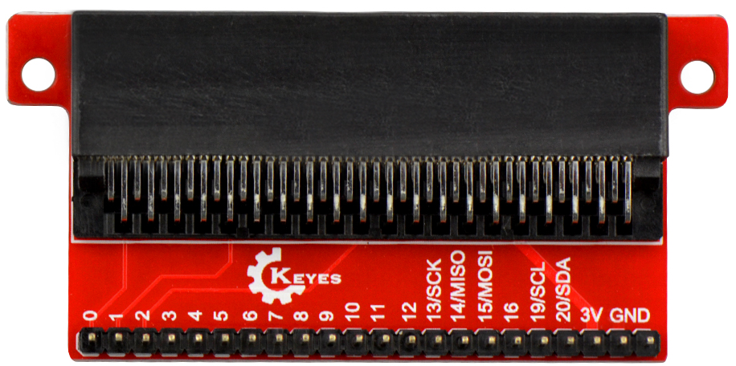
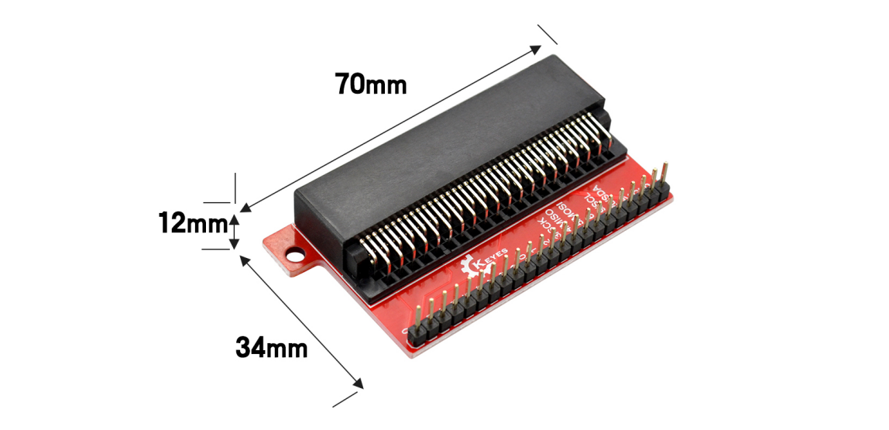

# KE0141 Keyes micro:bit Breakout 扩展板 (红色环保)



---

## 1. 介绍
**Keyes micro:bit Breakout 扩展板** 是为 BBC micro:bit 开发板设计的转接头，旨在简化 micro:bit 与其他电子元件之间的连接。该扩展板将 micro:bit 的所有引脚和电源引出到边上的排针上，用户可以通过杜邦线轻松连接到面包板或其他模块，方便进行各种实验和项目开发。

**micro:bit** 是由英国广播电视公司（BBC）为青少年编程教育设计的入门级开发板，支持微软开发的 PXT (MakeCode) 图形化编程环境，能够在 Windows、macOS、iOS、安卓等多种操作系统下使用，无需额外下载编译器。

---

## 2. 规格参数
- **产品型号**：KE0141  
- **输入电压**：DC 3V  
- **排针间距**：2.54mm  
- **尺寸**：约 70mm × 34mm × 12mm  
- **重量**：约 18.6g  



---

## 3. 使用方法
1. **安装 micro:bit**  
   - 将 micro:bit 开发板插入扩展板的金手指插槽，确保连接牢固。  
2. **连接外部设备**  
   - 使用杜邦线将扩展板上的排针与面包板或其他元件连接。  
3. **实验示例**  
   - 例如，连接一个外接 LED 灯，完成 LED 闪烁实验。以下是连接示意图：

4. **编写代码**  
   - 在 micro:bit 上编写相应的代码以控制 LED 的闪烁。例如，使用 MakeCode 编写简单的闪烁程序：

```cpp
basic.forever(function () {
    pins.digitalWritePin(DigitalPin.P0, 1) // 点亮 LED
    basic.pause(500)
    pins.digitalWritePin(DigitalPin.P0, 0) // 熄灭 LED
    basic.pause(500)
})
```


-------

## 4. 注意事项

1. **电源输入**：确保输入电压为 DC 3V，避免过压损坏扩展板或 micro:bit。  
2. **连接牢固**：在插拔 micro:bit 和杜邦线时，确保连接牢固，避免接触不良。  
3. **杜邦线使用**：使用标准杜邦线连接扩展板与其他元件，确保引脚对应正确。  
4. **实验环境**：保持实验环境干燥整洁，避免短路或静电损坏设备。

---

## 5. 参考链接
- **官方文档**  
  - [micro:bit 官方](https://microbit.org/)  
  - [MakeCode 在线编程](https://makecode.microbit.org/)  
- **Keyes 相关**  
  - [Keyes 官网](http://www.keyestudio.com/)  
  - [Keyes 天猫旗舰店](https://keyes.tmall.com/)  
- **开发辅助**  
  - [Mu Editor](https://codewith.mu/) (micro:bit Python 编程环境)  
  - [Arduino 官方](https://www.arduino.cc/) (可参考一般电子开发资料)

如有更多疑问，请联系 Keyes 官方客服或加入相关创客社区交流。祝使用愉快！