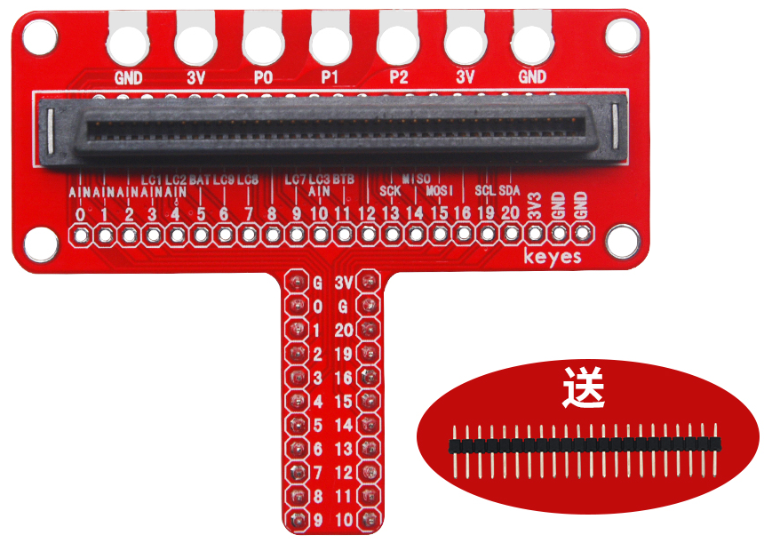
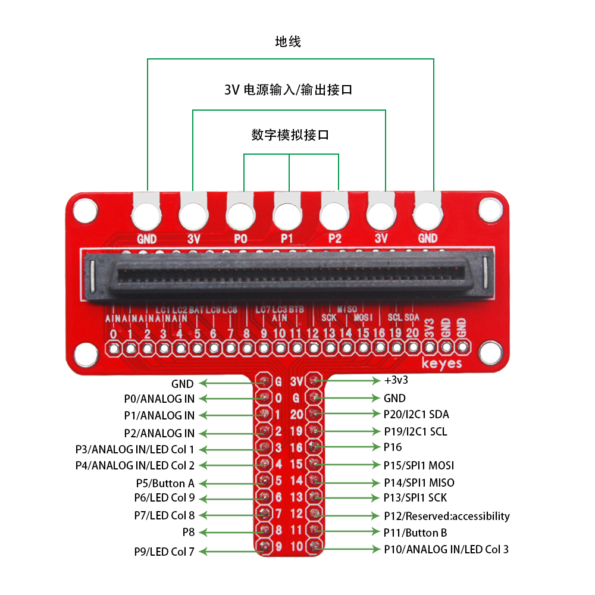
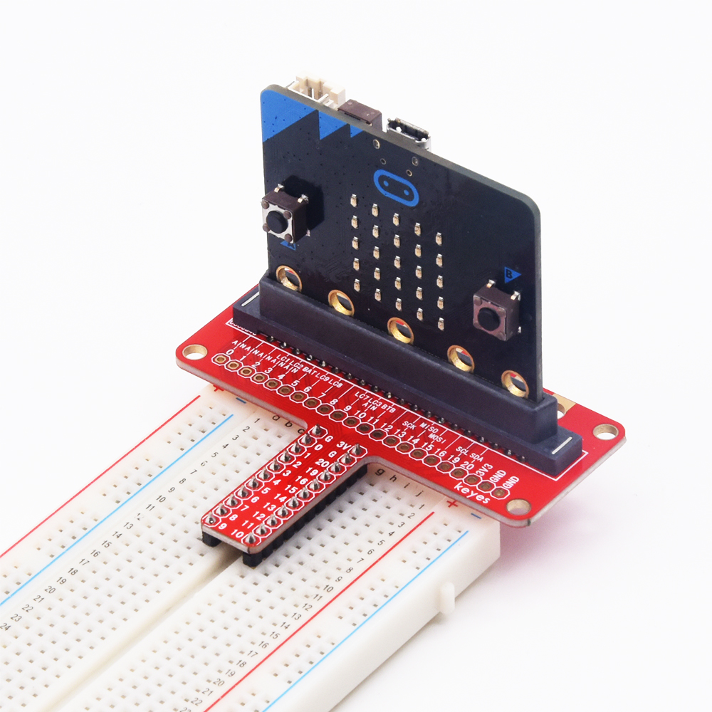
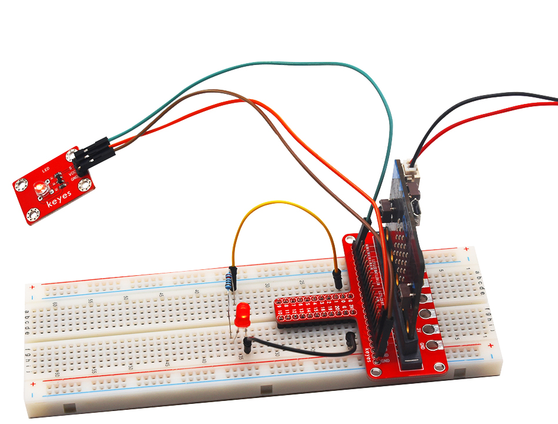

# KE0149 Keyes micro:bit GPIO T型扩展板 转接头 V2.0 环保

---

## 1. 说明
**micro:bit** 是一款由英国广播电视公司为青少年编程教育设计的入门级开发板。它支持微软开发的 PXT 图形化编程界面，无需额外下载编译器，可以在 Windows、macOS、iOS、安卓等多种操作系统下使用。

为了方便 micro:bit 开发板接线和供电，我们特别设计了这款扩展板。扩展板兼容三种接线方式：
1. 直接将扩展板插在面包板上，将电子元件连接在面包板，然后与 micro:bit 开发板通信。
2. 利用扩展板上的金手指接口，直接与 micro:bit 控制板上的金手指接口连接通信。此接口包含 2 个电源输出和 P0、P1、P2 共 3 个信号端。
3. 扩展板自带间距为 2.54mm 的排针接口，用户可以焊接排针到扩展板的排针接口，外接电子元件，与 micro:bit 控制板通信。

为了方便扩展板固定在其他设备上，扩展板自带 4 个直径为 3mm 的定位孔。

---

## 2. 规格参数
- **尺寸**：68mm × 56mm × 20mm  
- **重量**：13.6g  

---

## 3. 连接方法

### 3.1 直接插入面包板
- 将扩展板直接插入面包板，使用杜邦线将电子元件连接到面包板上，然后与 micro:bit 开发板进行通信。

### 3.2 金手指接口连接
- 使用金手指接口将扩展板直接连接到 micro:bit 控制板。此方法仅支持 2 个电源输出和 P0、P1、P2 信号端。

### 3.3 排针接口连接
- 将间距为 2.54mm 的排针焊接到扩展板的排针接口，外接电子元件，通过排针与 micro:bit 控制板进行通信。

### 3.4 定位孔
- 使用直径为 3mm 的螺丝或其他固定方式，将扩展板固定在其他设备上，确保稳定性。

---

## 4. 注意事项
1. **电源输入**：确保电源电压在 micro:bit 允许的范围内，避免损坏扩展板和开发板。
2. **连接牢固**：在插拔杜邦线或排针时，确保连接牢固，避免接触不良。
3. **焊接注意**：焊接排针时，注意焊接质量，避免短路或虚焊。
4. **实验环境**：保持实验环境干燥整洁，避免静电损坏设备。

---

## 5. 参考链接
- **micro:bit 官方文档**  
  - [micro:bit 官方](https://microbit.org/)  
- **Keyes 相关**  
  - [Keyes 官网](http://www.keyestudio.com/)  
  - [Keyes 天猫旗舰店](https://keyes.tmall.com/)  
- **开发辅助**  
  - [micro:bit 编程指南](https://microbit.org/guide/)  
  - [Arduino IDE 下载](https://www.arduino.cc/en/software)  

如有更多疑问，请联系 Keyes 官方客服或加入相关创客社区交流。祝使用愉快！